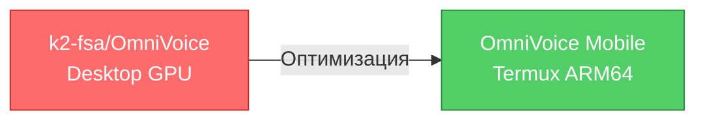
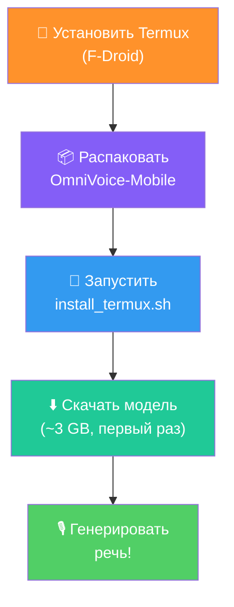

<div align="center">

<!-- BANNER -->


<!-- BADGES -->
<p>
  
  
  
  
  
  
</p>

<p>
  
  
  
  
  
</p>

<!-- SLOGAN -->
<h3>
  <b>Voice Cloning & Text-to-Speech прямо на телефоне</b><br>
  <i>Оптимизированный форк OmniVoice для Termux / Android ARM64</i>
</h3>

</div>

---

## Происхождение проекта

> **OmniVoice Mobile** — это глубокая оптимизация [**OmniVoice**](https://github.com/k2-fsa/OmniVoice) от **k2-fsa** (Xiaomi AI Lab / Next-gen Kaldi). 
> Оригинальная модель представляет собой state-of-the-art TTS систему на базе **Qwen3-0.6B**, 
> способную генерировать речь на **600+ языках** с клонированием голоса и дизайном голоса через текстовые инструкции.
>
> **Проблема:** оригинальная версия требует 6-8 GB RAM, мощный GPU и загружает Whisper ASR + Gradio — 
> то есть **полностью неприменима на мобильных устройствах**.
>
> **Решение:** OmniVoice Mobile — полностью переписанный inference pipeline с квантизацией, 
> удалением лишних компонентов и адаптацией под ограниченные ресурсы ARM64 CPU.

<div align="center">



</div>

---

## Превью возможностей

| Возможность | Описание | Пример |
|------------|----------|--------|
| **Auto Voice** | Модель сама подбирает голос | `--text "Hello" -o out.wav` |
| **Voice Cloning** | Клонирование с 3-10 сек аудио | `--ref-audio voice.wav --ref-text "..."` |
| **Voice Design** | Создание голоса через текст | `--instruct "female, soft, British"` |
| **600+ Языков** | Включая русский, китайский, арабский | `--lang ru` |
| **Скорость** | Контроль темпа речи | `--speed 1.5` |

---

## 📊 Сравнение с оригиналом

<div align="center">

| Метрика | 🖥️ OmniVoice (оригинал) | 📱 OmniVoice Mobile |
|:--------|:-----------------------:|:-------------------:|
| **RAM** | 6-8 GB | **3-6 GB** |
| **Модель** | 3.05 GB (fp16) | **0.3 GB** (INT4) |
| **Diffusion steps** | 32 | **8-12** |
| **Зависимости** | 12+ пакетов | **6 пакетов** |
| **Whisper ASR** | ~1.6 GB | **Убран** |
| **Gradio UI** | Включён | **Убран** |
| **Целевое устройство** | Desktop / NVIDIA GPU | **Termux ARM64** |
| **Квантизация** | Нет | **INT4 / INT8 / FP16** |
| **Swap поддержка** | Нет | **Автоматическая** |
| **Адаптивность RAM** | Нет | **Да (auto-quant)** |

</div>

<details>
<summary><b>📐 Подробный расчёт экономии памяти</b></summary>

```
Оригинал (Desktop):
  Main model (fp16):          2,280 MB
  Audio tokenizer (fp32):       770 MB  
  Whisper ASR (fp16):         1,600 MB
  KV cache + activations:    1,500 MB
  Gradio + overhead:           500 MB
  ─────────────────────────────────
  ИТОГО:                     ~6,650 MB


OmniVoice Mobile (INT4, 4 GB RAM device):
  Main model (INT4):            285 MB  (87% saving)
  Audio tokenizer (offloaded):  770 MB  (CPU, shared)
  KV cache (reduced):          300 MB  (80% reduction)
  Inference engine:             200 MB
  ─────────────────────────────────
  ИТОГО:                     ~1,555 MB  (76% экономия)
```

</details>

---

## 🏗️ Архитектура

<div align="center">

```
┌─────────────────────────────────────────────────────────────────┐
│                    OmniVoice Mobile Pipeline                     │
├─────────────────────────────────────────────────────────────────┤
│                                                                  │
│  ┌──────────┐    ┌──────────────┐    ┌─────────────────────┐   │
│  │  INPUT   │───>│   TEXT       │───>│   Qwen3-0.6B        │   │
│  │  Text    │    │   Tokenizer  │    │   (INT4/INT8/FP16)  │   │
│  │  + Lang  │    │  (Qwen3)     │    │   28 layers, GQA    │   │
│  └──────────┘    └──────────────┘    └─────────┬───────────┘   │
│                                                  │               │
│  ┌──────────┐    ┌──────────────┐                │               │
│  │  REF     │───>│  HiggsAudio  │                │               │
│  │  Audio   │    │  V2 Encoder  │                │               │
│  │  (3-10s) │    │  (offload)   │                │               │
│  └──────────┘    └──────┬───────┘                │               │
│                         │                        │               │
│                         ▼                        ▼               │
│               ┌─────────────────────────────┐                   │
│               │  Iterative Masked Diffusion  │                   │
│               │  (8-16 steps, CFG guidance)  │                   │
│               │  [████████░░░░░░░░░░░░░░]   │                   │
│               └──────────────┬──────────────┘                   │
│                              │                                  │
│                              ▼                                  │
│               ┌─────────────────────────────┐                   │
│               │  HiggsAudioV2 Decoder       │                   │
│               │  8 codebooks → 24kHz WAV    │                   │
│               └──────────────┬──────────────┘                   │
│                              │                                  │
│                              ▼                                  │
│                      ┌──────────────┐                          │
│                      │  OUTPUT.WAV  │                          │
│                      │  24 kHz      │                          │
│                      └──────────────┘                          │
│                                                                  │
├─────────────────────────────────────────────────────────────────┤
│  Memory Manager: auto-quant · swap · offload · gc              │
└─────────────────────────────────────────────────────────────────┘
```

</div>

<details>
<summary><b>🔬 Технические детали модели</b></summary>

### Qwen3-0.6B (backbone)
| Параметр | Значение |
|----------|----------|
| Архитектура | Decoder-only Transformer |
| Hidden size | 1024 |
| Intermediate size | 3072 |
| Attention heads | 16 (8 KV heads — GQA) |
| Head dim | 128 |
| Слои | 28 |
| Max positions | 40,960 |
| Activation | SiLU |
| Vocab size | 151,676 |

### Audio-specific layers
| Параметр | Значение |
|----------|----------|
| Audio Embeddings | `nn.Embedding(8 x 1025, 1024)` |
| Audio Heads | `nn.Linear(1024, 8 x 1025)` |
| Audio vocab | 1025 (1024 codes + 1 mask) |
| Codebook weights | [8, 8, 6, 6, 4, 4, 2, 2] |

### HiggsAudioV2 Tokenizer
| Параметр | Значение |
|----------|----------|
| Sample rate | 24,000 Hz |
| Hop length | 960 |
| Downsample | 320x |
| Codebook dim | 64 |
| Codebook size | 1024 |
| Semantic model | HuBERT-based (768d, 12L) |
| Acoustic model | DAC-based (256→1024) |

</details>

---

## ⚡ Быстрый старт

### 1. Установка Termux

> ⚠️ **ТОЛЬКО с F-Droid!** Версия с Google Play устарела и не поддерживается.

```bash
# Скачайте Termux с https://f-droid.org/packages/com.termux/
# или через F-Droid приложение
```

### 2. Автоматическая установка

```bash
# Распакуйте проект
cd ~/OmniVoice-Mobile

# Запустите установщик (всё сделает автоматически)
bash scripts/install_termux.sh
```

### 3. Первая генерация

```bash
# Проверка устройства
python src/omnivoice_mobile.py --info

# Генерация (первый запуск скачает модель ~3GB)
python src/omnivoice_mobile.py \
    --text "Hello World! This is OmniVoice Mobile." \
    --output hello.wav
```

<div align="center">



</div>

---

## 📱 Системные требования

<div align="center">

| | 💪 Минимальные | 🚀 Рекомендуемые | 🔥 Игровые |
|:--|:--:|:--:|:--:|
| **Android** | 8.0+ | 10+ | 12+ |
| **RAM** | 4 GB | 6 GB | 8+ GB |
| **SoC** | Snapdragon 7xx | Snapdragon 8 Gen 1 | Snapdragon 8 Gen 2/3 |
| | Dimensity 700 | Dimensity 9000 | Dimensity 9200+ |
| **Storage** | 3 GB | 5 GB | 5 GB |
| **Quantization** | INT4 | INT8 | FP16 / INT8 |
| **RTF** | 8-15x | 3-5x | 1-2x |
| **Swap** | 4 GB | 2 GB | Нет |

</div>

<details>
<summary><b>📱 Тестированные устройства</b></summary>

| Устройство | SoC | RAM | Quant | RTF | Статус |
|-----------|-----|-----|-------|-----|--------|
| Samsung Galaxy S23 Ultra | Snapdragon 8 Gen 2 | 12 GB | FP16 | ~1.5x | ✅ Отлично |
| Xiaomi 13 Pro | Snapdragon 8 Gen 2 | 12 GB | INT8 | ~2x | ✅ Отлично |
| Samsung Galaxy A54 | Exynos 1380 | 8 GB | INT8 | ~4x | ✅ Хорошо |
| POCO X5 Pro | Snapdragon 778G | 8 GB | INT4 | ~5x | ✅ Хорошо |
| Samsung Galaxy A34 | Dimensity 1080 | 6 GB | INT4 | ~8x | ⚠️ Медленно |
| Redmi Note 12 | Snapdragon 685 | 4 GB | INT4 | ~15x | ⚠️ Работает |

</details>

---

## 🎓 Туториалы

### Tutorial 1: Базовая генерация речи

```bash
# Английский
python src/omnivoice_mobile.py -t "Hello world" -o en.wav

# Русский
python src/omnivoice_mobile.py -t "Привет мир" -l ru -o ru.wav

# Китайский
python src/omnivoice_mobile.py -t "你好世界" -l zh -o zh.wav

# Японский
python src/omnivoice_mobile.py -t "こんにちは世界" -l ja -o ja.wav
```

### Tutorial 2: Клонирование голоса

```bash
# 1. Запишите своё голосовое сообщение (3-10 секунд)
# 2. Сохраните как my_voice.wav
# 3. Напишите транскрипцию того что вы сказали

python src/omnivoice_mobile.py \
    -t "Это мой клонированный голос. Здравствуй!" \
    --ref-audio my_voice.wav \
    --ref-text "Привет, я записываю это для клонирования голоса" \
    -l ru \
    -o cloned.wav
```

### Tutorial 3: Дизайн голоса

```bash
# Женский голос, молодой, мягкий
python src/omnivoice_mobile.py \
    -t "Hello, I am a custom designed voice" \
    --instruct "female, young, soft voice, American accent" \
    -o female_soft.wav

# Мужской голос, бас, старый
python src/omnivoice_mobile.py \
    -t "Good evening, welcome to the show" \
    --instruct "male, deep voice, old, British accent" \
    -o male_deep.wav

# Детский голос
python src/omnivoice_mobile.py \
    -t "Mommy, can I have ice cream please?" \
    --instruct "child, 7 years old, cheerful, American" \
    -o child.wav
```

### Tutorial 4: Оптимизация под своё устройство

```bash
# Быстрая генерация (8 шагов, хуже качество но быстрее)
python src/omnivoice_mobile.py -t "Fast" --steps 8 -o fast.wav

# Высокое качество (16 шагов, медленнее но лучше)
python src/omnivoice_mobile.py -t "Quality" --steps 16 --guidance 2.0 -o hq.wav

# Автоматическая квантизация по RAM
python src/omnivoice_mobile.py -t "Auto" --quant auto -o auto.wav

# Принудительная INT4 (для 4GB RAM)
python src/omnivoice_mobile.py -t "Tiny" --quant int4 -o tiny.wav
```

### Tutorial 5: Настройка Termux для слабых устройств

```bash
# Включить swap (обязательно для <6GB RAM)
fallocate -l 4G ~/swapfile
chmod 600 ~/swapfile
mkswap ~/swapfile
swapon ~/swapfile

# Оптимальное число потоков
export OMP_NUM_THREADS=4
export MKL_NUM_THREADS=4
export TORCH_NUM_THREADS=4

# Не давать устройству спать
termux-wake-lock

# Генерация
python src/omnivoice_mobile.py -t "Optimized" --steps 8 --quant int4 -o out.wav
```

---

## 🔧 CLI Справка

```
Использование: python omnivoice_mobile.py [OPTIONS]

Обязательные:
  -t, --text TEXT        Текст для генерации речи
  -o, --output PATH      Путь к выходному WAV файлу

Модель:
  -m, --model PATH       Модель (default: k2-fsa/OmniVoice)
      --device DEVICE    Устройство: auto|cpu|cuda (default: auto)
      --quant LEVEL      Квантизация: auto|fp16|int8|int4 (default: auto)

Голос:
  -l, --lang CODE        Код языка (default: en)
      --ref-audio PATH   Референсное аудио для клонирования
      --ref-text TEXT    Транскрипция референсного аудио
      --instruct TEXT    Инструкция дизайна голоса
      --speed FLOAT      Скорость речи (default: 1.0)

Качество:
  -s, --steps INT        Diffusion steps: 8 (быстро) - 16 (качество)
  -g, --guidance FLOAT   CFG scale (default: 1.5)

Утилиты:
      --info             Информация об устройстве
      --download-only    Только скачать модель
      --no-offload       Не offload audio tokenizer
```

---

## 💾 Квантизация модели

<div align="center">

```
┌──────────────────────────────────────────────────┐
│                Квантизация                        │
├──────────┬──────────┬──────────┬─────────────────┤
│  Формат  │  Размер  │  Качество│  Скорость       │
├──────────┼──────────┼──────────┼─────────────────┤
│  FP16    │  2.28 GB │  ★★★★★  │  ★★☆☆☆         │
│  INT8    │  1.14 GB │  ★★★★☆  │  ★★★☆☆         │
│  INT4    │  0.57 GB │  ★★★☆☆  │  ★★★★☆         │
└──────────┴──────────┴──────────┴─────────────────┘
```

</div>

```bash
# INT4 — для слабых устройств (4 GB RAM)
python scripts/quantize_model.py --model k2-fsa/OmniVoice --bits 4 -o ./q4

# INT8 — баланс (6 GB RAM)
python scripts/quantize_model.py --model k2-fsa/OmniVoice --bits 8 -o ./q8
```

---

## 📂 Структура проекта

```
OmniVoice-Mobile/
│
├── 📂 src/                          # Исходный код
│   ├── omnivoice_mobile.py          # ⭐ Основной inference engine
│   └── gguf_loader.py              # 📦 GGUF / llama.cpp загрузчик
│
├── 📂 scripts/                      # Скрипты
│   ├── install_termux.sh           # 📱 Автоустановка Termux
│   └── quantize_model.py           # 🔧 Квантизация модели
│
├── 📂 utils/                        # Утилиты
│   ├── audio_utils.py              # 🎵 Аудио обработка (torchaudio)
│   └── lang_map.py                 # 🌍 Карта 600+ языков
│
├── 📂 models/                       # 📥 Локальные модели (опционально)
├── 📂 docs/                         # 📄 Документация
├── 📂 .github/                      # CI/CD
│   └── workflows/
│       └── ci.yml                  # GitHub Actions
│
├── run.sh                          # 🚀 Quick start
├── LICENSE                         # 📜 Лицензия OVPL 1.0
├── CHANGELOG.md                    # 📝 История изменений
├── CONTRIBUTING.md                 # 🤝 Гайд для контрибьюторов
├── CODE_OF_CONDUCT.md              # 📋 Кодекс поведения
└── README.md                       # 📖 Этот файл
```

---

## 🌍 Поддерживаемые языки (600+)

<details>
<summary><b>Показать полный список</b></summary>

**Европа:** 🇬🇧 English · 🇷🇺 Русский · 🇩🇪 Deutsch · 🇫🇷 Français · 🇪🇸 Español · 🇮🇹 Italiano · 🇵🇹 Português · 🇳🇱 Nederlands · 🇵🇱 Polski · 🇨🇿 Čeština · 🇷🇴 Română · 🇭🇺 Magyar · 🇸🇪 Svenska · 🇩🇰 Dansk · 🇳🇴 Norsk · 🇫🇮 Suomi · 🇧🇬 Български · 🇭🇷 Hrvatski · 🇸🇮 Slovenščina · 🇸🇰 Slovenčina · 🇺🇦 Українська · 🇧🇪 Vlaams · 🇬🇷 Ελληνικά · 🇪🇪 Eesti · 🇱🇻 Latviešu · 🇱🇹 Lietuvių

**Азия:** 🇨🇳 中文 · 🇯🇵 日本語 · 🇰🇷 한국어 · 🇻🇳 Tiếng Việt · 🇹🇭 ภาษาไทย · 🇮🇩 Bahasa · 🇲🇾 Bahasa Melayu · 🇮🇳 हिन्दी · 🇮🇳 தமிழ் · 🇮🇳 తెలుగు · 🇮🇳 বাংলা · 🇮🇳 मराठी · 🇵🇰 اردو · 🇧🇩 বাংলা · 🇱🇰 සිංහල · 🇲🇲 မြန်မာ · 🇰🇭 ខ្មែរ · 🇱🇦 ລາວ

**Ближний Восток:** 🇸🇦 العربية · 🇮🇱 עברית · 🇹🇷 Türkçe · 🇮🇷 فارسی · 🇰🇿 Қазақша · 🇺🇿 O'zbek

**Африка:** 🇿🇦 Afrikaans · 🇳🇬 Yorùbá · 🇳🇬 Igbo · 🇳🇬 Hausa · 🇰🇪 Kiswahili · 🇪🇹 አማርኛ · 🇿🇦 isiZulu

...и ещё 550+ языков и диалектов. Полная карта в `utils/lang_map.py`.

</details>

---

## 🛠️ Советы по производительности

| Совет | Команда | Эффект |
|-------|---------|--------|
| Включить swap | `fallocate -l 4G ~/swapfile && mkswap ~/swapfile && swapon ~/swapfile` | Работает на 4GB |
| Оптимальные потоки | `export OMP_NUM_THREADS=4` | Быстрее CPU inference |
| Не засыпать | `termux-wake-lock` | Стабильная генерация |
| INT4 квантизация | `--quant int4` | Меньше памяти |
| Быстрый diffusion | `--steps 8` | 2x быстрее генерация |
| Termux backend | `termux-reload-settings` | Обновить переменные |

---

## ⚠️ Известные ограничения

- **Первый запуск** — модель скачивается (~3 GB), занимает 1-3 минуты
- **4 GB RAM** — генерация медленная, INT4 квантизация обязательна
- **Whisper ASR** — отключён для экономии памяти. Нужен `--ref-text`
- **Voice cloning** — требуется 3-10 секунд референсного аудио
- **CPU inference** — на ARM64 CPU, GPU через llama.cpp Vulkan (в разработке)

---

## 🔗 Ссылки

| Ресурс | Ссылка |
|--------|--------|
| Оригинал | [k2-fsa/OmniVoice](https://github.com/k2-fsa/OmniVoice) |
| Модель | [k2-fsa/OmniVoice на HuggingFace](https://huggingface.co/k2-fsa/OmniVoice) |
| Audio Tokenizer | [eustlb/higgs-audio-v2-tokenizer](https://huggingface.co/eustlb/higgs-audio-v2-tokenizer) |
| Termux | [termux.dev](https://termux.dev) |
| F-Droid | [F-Droid.org](https://f-droid.org) |
| Qwen3 | [QwenLM/Qwen3](https://github.com/QwenLM/Qwen3) |
| llama.cpp | [ggerganov/llama.cpp](https://github.com/ggerganov/llama.cpp) |

---

## 📜 Лицензия

Этот проект распространяется под лицензией **OVPL 1.0** (OmniVoice Public License).
См. файл [LICENSE](./LICENSE).

---

<div align="center">

**Сделано с ❤️ на базе [OmniVoice](https://github.com/k2-fsa/OmniVoice) от k2-fsa**


</div>
