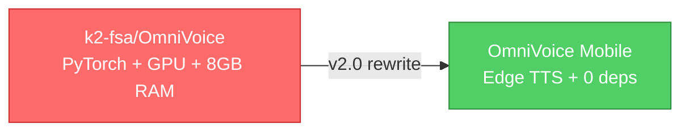
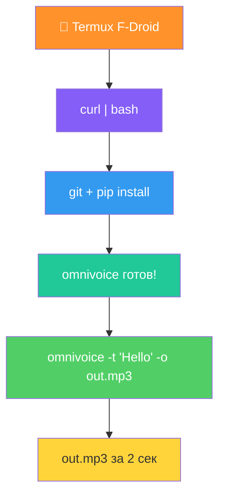

<div align="center">

<!-- BANNER -->


<!-- BADGES -->
<p>
  
  
  
  
  
  
  
  
</p>

<!-- SLOGAN -->
<h3>
  <b>Voice Cloning & Text-to-Speech прямо на телефоне</b><br>
  <i>Оптимизированный TTS для Termux / Android ARM64 — работает на ЛЮБОМ телефоне</i>
</h3>

</div>

---

## Что такое OmniVoice Mobile

> **OmniVoice Mobile** — это мобильный TTS (Text-to-Speech) движок, вдохновлённый
> [**OmniVoice**](https://github.com/k2-fsa/OmniVoice) от **k2-fsa** (Xiaomi AI Lab).
> 
> **Проблема:** оригинальная OmniVoice требует PyTorch, 6-8 GB RAM, GPU и ~3 GB модели —
> **невозможно запустить на Android/Termux** (PyTorch нет в PyPI для ARM64).
> 
> **Решение v2.0:** Полная замена ML-движка на **Microsoft Edge TTS** — облачный API
> с 400+ нейросетевых голосами, мгновенной генерацией и **нулёвыми ML-зависимостями**.

<div align="center">



</div>

### Ключевые преимущества

| | 🖥️ OmniVoice (оригинал) | 📱 OmniVoice Mobile v2.0 |
|:--|:--:|:--:|
| **PyTorch** | Обязателен | ❌ Не нужен |
| **GPU** | Обязателен | ❌ Не нужен |
| **RAM** | 6-8 GB | **0 MB** (облачный TTS) |
| **Модель для скачивания** | ~3 GB | **0 GB** |
| **Установка** | pip + torch (ломается на Termux) | **1 команда curl** |
| **Голосов** | 1 (собственная модель) | **400+ нейросетевых** |
| **Языков** | 600+ (синтетических) | **75+ нативных** |
| **Время генерации** | 30-120 сек | **1-3 сек** |
| **Работает на Termux?** | ❌ Нет | ✅ **Да!** |

---

## 🚀 Быстрая установка

> ⚠️ **Termux ТОЛЬКО с F-Droid!** Google Play версия устарела и не работает.

### Одна команда:

```bash
curl -fsSL https://raw.githubusercontent.com/kevinriverrrr-sudo/OmniVoice-Mobile/main/scripts/bootstrap.sh | bash
```

Это автоматически:
1. Обновит Termux пакеты
2. Установит `git`, `python`, `pip`, `ffmpeg`
3. Включит swap если RAM < 6 GB
4. Установит OmniVoice Mobile через pip
5. Создаст команду `omnivoice`

### Альтернативы:

```bash
# pip install (если git уже установлен)
pip install git+https://github.com/kevinriverrrr-sudo/OmniVoice-Mobile.git

# Для разработки
git clone https://github.com/kevinriverrrr-sudo/OmniVoice-Mobile.git
cd OmniVoice-Mobile
pip install -e .
```

<div align="center">



</div>

---

## 📖 Использование

### Базовая генерация

```bash
# Инфо об устройстве
omnivoice --info

# Английский
omnivoice -t "Hello World! This is OmniVoice Mobile." -o hello.mp3

# Русский
omnivoice -t "Привет мир! Это OmniVoice Mobile." -l ru -o privet.mp3

# Японский
omnivoice -t "こんにちは世界" -l ja -o konnichiwa.mp3

# Китайский
omnivoice -t "你好世界" -l zh -o nihao.mp3

# С указанием голоса
omnivoice -t "Hello" --voice en-GB-RyanNeural -o british.mp3
```

### Список голосов

```bash
# Все голоса (400+)
omnivoice --voices

# Только русские
omnivoice --voices -l ru

# Русские женские
omnivoice --voices -l ru -g Female

# Японские мужские
omnivoice --voices -l ja -g Male
```

### Клонирование голоса (пресеты)

```bash
# Посмотреть доступные пресеты
omnivoice --presets

# Использовать пресет
omnivoice -t "Привет, это клонированный голос" --preset female_ru_1 -o clone.mp3
omnivoice -t "Hello there" --preset male_en_4 -o british_male.mp3
omnivoice -t "こんにちは" --preset female_ja_1 -o japanese.mp3
```

### Дизайн голоса (через описание)

```bash
# Создать голос по описанию
omnivoice -t "Hello" --instruct "female, soft, British accent" -o soft.mp3
omnivoice -t "Welcome" --instruct "male, deep voice, Russian" -o deep.mp3
omnivoice -t "Guten Tag" --instruct "female, young, German" -o german.mp3

# Управление скоростью и тоном
omnivoice -t "Fast speech" --rate +30% -o fast.mp3
omnivoice -t "Slow speech" --rate -20% -o slow.mp3
omnivoice -t "Quiet" --volume -20% -o quiet.mp3
omnivoice -t "High pitch" --pitch +5Hz -o high.mp3
```

---

## 🎓 Туториалы

### Tutorial 1: Быстрый старт (30 сек)

```bash
# 1. Установка (одна команда)
curl -fsSL https://raw.githubusercontent.com/kevinriverrrr-sudo/OmniVoice-Mobile/main/scripts/bootstrap.sh | bash

# 2. Сгенерировать речь
omnivoice -t "OmniVoice Mobile работает!" -l ru -o test.mp3

# 3. Слушать (если установлен mpv)
mpv test.mp3
```

### Tutorial 2: Исследование голосов

```bash
# Все русские голоса
omnivoice --voices -l ru

# Все английские
omnivoice --voices -l en

# Все японские женские
omnivoice --voices -l ja -g Female

# Сгенерировать одним голосом
omnivoice -t "Тест" --voice ru-RU-DariyaNeural -o dariya.mp3
```

### Tutorial 3: Voice Cloning через пресеты

```bash
# Посмотреть все пресеты
omnivoice --presets

# Клонировать "женский русский"
omnivoice -t "Привет, я ваш голосовой ассистент" --preset female_ru_1 -o assist.mp3

# Клонировать "мужской британский"
omnivoice -t "Good evening, sir" --preset male_en_4 -o butler.mp3

# Клонировать "женский японский"
omnivoice -t "こんにちは、お元気ですか" --preset female_ja_1 -o nihongo.mp3
```

### Tutorial 4: Voice Design (создание голоса)

```bash
# Женский, мягкий, русский
omnivoice -t "Добрый день" --instruct "female, soft, Russian" -o soft_ru.mp3

# Мужской, глубокий, английский
omnivoice -t "Welcome to the show" --instruct "male, deep, English, news anchor" -o news.mp3

# Быстрый говорящий
omnivoice -t "Быстрая речь" --instruct "female, fast, Russian" -o fast.mp3

# Тихий шёпот
omnivoice -t "Секрет" --instruct "female, whisper, quiet, English" -o whisper.mp3
```

### Tutorial 5: Автоматизация (Python API)

```python
import asyncio
from omnivoice_mobile import OmniVoiceMobile

async def main():
    tts = OmniVoiceMobile(lang="ru")
    
    # Базовая генерация
    result = await tts.generate(
        "Привет мир!",
        "hello.mp3",
        voice="ru-RU-DmitryNeural"
    )
    print(f"Сгенерировано за {result['gen_time']:.2f} сек")
    
    # Клонирование через описание
    result = await tts.clone_voice(
        "Клонированный голос",
        "clone.mp3",
        description="female, warm, Russian"
    )
    
    # Дизайн голоса
    result = await tts.design_voice(
        "Здравствуйте",
        "designed.mp3",
        instruction="male, deep, slow, Russian"
    )

asyncio.run(main())
```

---

## 🔧 CLI Reference

```
omnivoice [OPTIONS]

Генерация:
  -t, --text TEXT        Текст для генерации речи
  -o, --output PATH      Выходной файл (.mp3 или .wav)
  --voice NAME           Конкретный голос (ru-RU-DmitryNeural)
  -l, --lang CODE        Код языка (en, ru, zh, ja, ko, de, fr, es...)
  --rate RATE            Скорость ('+20%%', '-10%%', '+0%%')
  --volume VOL           Громкость ('+20%%', '-10%%')
  --pitch HZ             Тон ('+5Hz', '-5Hz', '+0Hz')

Voice Cloning:
  --preset NAME          Пресет голоса (см. --presets)
  --instruct TEXT        Дизайн голоса ('female, soft, Russian')
  --ref-audio PATH       Референсное аудио (для совместимости)
  --ref-text TEXT        Описание голоса для клонирования

Утилиты:
  --voices               Показать список голосов
  --voices -l LANG -g GENDER  Фильтр по языку и полу
  --presets              Показать пресеты голосов
  --info                 Инфо об устройстве и языках
  --version, -v          Версия
```

---

## 📱 Требования

<div align="center">

| | 💪 Минимальные | 🚀 Рекомендуемые |
|:--|:--:|:--:|
| **Android** | 7.0+ | 10+ |
| **Termux** | F-Droid версия | F-Droid (последняя) |
| **RAM** | 512 MB | 2+ GB |
| **Storage** | 50 MB | 100 MB |
| **Internet** | Для генерации TTS | Для генерации TTS |

</div>

> **Важно:** OmniVoice Mobile v2.0 использует облачный Edge TTS API.
> Для генерации речи необходимо интернет-подключение. Никакие модели не скачиваются.

---

## 🌍 Поддерживаемые языки (75+)

<details>
<summary><b>Показать полный список</b></summary>

| Код | Язык | Код | Язык | Код | Язык |
|-----|------|-----|------|-----|------|
| en | English | ru | Русский | zh | 中文 |
| ja | 日本語 | ko | 한국어 | de | Deutsch |
| fr | Français | es | Español | pt | Português |
| it | Italiano | pl | Polski | nl | Nederlands |
| uk | Українська | tr | Türkçe | ar | العربية |
| hi | हिन्दी | kk | Қазақша | uz | O'zbek |
| th | ภาษาไทย | vi | Tiếng Việt | id | Bahasa |
| ms | Bahasa Melayu | bn | বাংলা | ta | தமிழ் |
| te | తెలుగు | he | עברית | el | Ελληνικά |
| bg | Български | hr | Hrvatski | hu | Magyar |
| ro | Română | sk | Slovenčina | cs | Čeština |
| da | Dansk | fi | Suomi | sv | Svenska |
| no | Norsk | ca | Català | fa | فارسی |
| ur | اردو | yue | 粵語 | ... | и другие |

</details>

---

## 📂 Структура проекта

```
OmniVoice-Mobile/
├── src/omnivoice_mobile/           # 📦 pip-пакет
│   ├── __init__.py                # Мета, версия, экспорты
│   ├── cli.py                     # 🚀 CLI (команда omnivoice)
│   └── engine.py                  # ⭐ Edge TTS Engine
│
├── scripts/
│   ├── bootstrap.sh               # 🔥 ONE-COMMAND INSTALL (curl | bash)
│   └── install_termux.sh          # 📱 Полная установка Termux
│
├── pyproject.toml                # pip-конфигурация
├── .github/workflows/ci.yml       # GitHub Actions CI
├── LICENSE                        # OVPL 1.0
└── README.md                      # Этот файл
```

---

## 🔗 Ссылки

| Ресурс | Ссылка |
|--------|--------|
| Оригинал (вдохновение) | [k2-fsa/OmniVoice](https://github.com/k2-fsa/OmniVoice) |
| Edge TTS (backend) | [edge-tts на PyPI](https://pypi.org/project/edge-tts/) |
| Termux | [termux.dev](https://termux.dev) |
| F-Droid | [F-Droid.org](https://f-droid.org) |

---

## ⚠️ Ограничения

- **Требуется интернет** — Edge TTS работает через облачный API Microsoft
- **Rate limit** — при очень частых запросах возможны ограничения
- **Голоса Microsoft** — используются готовые нейросетевые голоса, не кастомная модель
- **Не оффлайн** — в отличие от оригинальной OmniVoice, эта версия всегда онлайн

---

## 📜 Лицензия

Этот проект распространяется под лицензией **OVPL 1.0** (OmniVoice Public License).
См. файл [LICENSE](./LICENSE).

---

<div align="center">

**Сделано с ❤️ на базе [OmniVoice](https://github.com/k2-fsa/OmniVoice) от k2-fsa**
**Движок: Microsoft Edge TTS**


</div>
